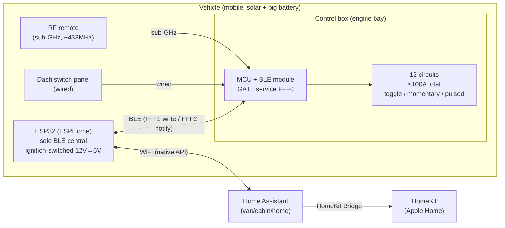

# Auxbeam AC-1200 → Home Assistant / HomeKit — how it all fits together

**Goal:** control a 12-gang Auxbeam AC-1200 switch panel (a proprietary, BLE-only vehicle
accessory) from Home Assistant and HomeKit — *without* installing the vendor app — by putting an
ESP32 in the vehicle that speaks the panel's BLE protocol and re-exposes each circuit as a normal
smart-home entity.

## The picture

Three independent command paths reach the control box: the **wired dash panel**, the **RF remote**
(separate sub-GHz radio), and **BLE**. We replace the phone app on that BLE path with the ESP32.
Because the panel exposes **no local API, no MQTT, no HTTP** — BLE is the *only* programmable seam,
and it turned out to be a clean one.

## Why this is tractable (the RE result)
Decompiling the vendor app (`com.qunchen.ble.switchpanel` v2.1.2; see [PROTOCOL.md](PROTOCOL.md))
showed the best-case design:
- **Fixed-UUID GATT profile** (service `FFF0`), **short unencrypted frames**, Write-Without-Response.
- **No pairing/PIN, no cloud, no account** — 100% local BLE.
- The panel **pushes state on notify (FFF2)**, so the bridge can track changes made from the dash
  panel or RF remote, not just its own writes.

## The data model: "loops" and nibbles
The firmware calls each circuit a **loop** (回路). Panel state is one **nibble per channel**, and the
nibble encodes *both* mode and on/off in one value:

| Nibble | Meaning              | | Nibble | Meaning               |
|--------|----------------------|-|--------|-----------------------|
| 0 / 1  | Toggle — OFF / ON    | | 4 / 5  | Pulsed — OFF / ON     |
| 2 / 3  | Momentary — OFF / ON | | 8      | leave channel alone   |

- **Control (FFF1):** `[0x0C header][6 packed bytes]` — 12 nibbles, channel 1 = high nibble of byte 1.
  Every command sets one channel and writes `8` (no-change) for the other 11, so each write is surgical.
  No checksum. e.g. *Ch1 ON* = `0C 18 88 88 88 88 88`.
- **State (FFF2):** same nibble packing, read or pushed via notify. `odd = ON`, `mode = nibble/2`.

Two more characteristics round it out:
- **Backlight (FFF4):** whole-panel `[brightness 0–255, R, G, B]`.
- **Pulse timing (FFFA):** one byte, **inverted** vs the app slider → real range **4–50**.

## The bridge: what ESPHome does
[switchpanel-bridge.esphome.yaml](switchpanel-bridge.esphome.yaml) maps protocol → HA entities:

| HA entity                | ESPHome mechanism                          | BLE action              |
|--------------------------|--------------------------------------------|-------------------------|
| 12 × **switch**          | template switch, one baked frame each       | write FFF1              |
| **light** "Backlight"    | rgb light → 3 outputs → debounced flush     | write FFF4 `[FF,R,G,B]` |
| **number** "Pulse Time"  | template number (4–50)                      | write FFFA              |
| (state feedback)         | ble_client text_sensor, `notify: true`      | subscribe FFF2          |

The ESP connects to the panel's BLE MAC, holds the single allowed central link, and bridges to HA
over the ESPHome native API on WiFi. **HomeKit comes for free**: HA's built-in HomeKit Bridge (or
Homebridge) re-exposes those entities to Apple Home — no HomeKit code on the ESP.

## Physical & electrical realities (what actually makes it work)
- **Single BLE central:** these modules accept one connection at a time. By *never* running the
  vendor app, the ESP owns the link uncontested; the wired panel and RF remote are separate paths
  and keep working regardless.
- **The ESP travels with the vehicle**, which dissolves BLE's few-meters range problem — put it near
  the control box's BLE module. HA/HomeKit only see the circuits when the vehicle is on your WiFi;
  that's expected and fine for a van/cabin/boat/shop parked on network.
- **Power:** the ESP is an always-on BLE client. On this build (solar + kWh battery) the draw is
  noise; still feed it from an **ignition-switched 12V→5V buck** (or deep-sleep) so a long park
  doesn't nibble the starter battery.
- **Radio:** ESP32 shares one 2.4GHz radio between WiFi + BLE; fine at this traffic level.

## Verified vs. confirm-on-hardware
**Verified from the app (exact):** GATT map; FFF1 frame + nibble encoding; FFF2 same encoding;
FFF4 `[bright,R,G,B]`; FFFA 4–50 inverted; local-only, no auth in the code path.
**Confirm on the bench (day one):** no-PIN connect; whether FFF2 notifies on *physical/RF* changes
(vs app-initiated only); whether the FFF2 readback carries the leading `0x0C` header; FFFA units;
the panel's BLE MAC + advertised name (expected `Controller12`). Checklist at the end of PROTOCOL.md.

## ⚠️ Safety
Some circuits may drive winches or other momentary/high-consequence loads. Keep those **out of any
automation** (or manual-only) — "HomeKit turned it on by accident" is genuinely bad. The panel's
physical switches and RF remote remain as independent overrides.

## File map
- [PROTOCOL.md](PROTOCOL.md) — full decoded BLE protocol + hardware verification checklist
- [switchpanel-bridge.esphome.yaml](switchpanel-bridge.esphome.yaml) — the ESP32 bridge (fill in MAC + WiFi)
- `apk/` — the decompiled app (`switchpanel-2.1.2.apk`); `jadx-out/` — decompiled sources
