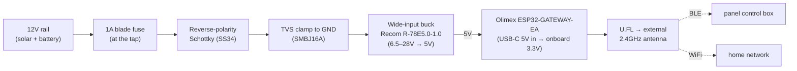

# Hardware — ESP32 bridge build (Olimex ESP32-GATEWAY-EA)

A rugged, RF-reliable build for the in-vehicle BLE→WiFi bridge described in
[ARCHITECTURE.md](ARCHITECTURE.md). This is the "best antenna + quality silicon, add a proper
automotive power front-end" path.

## Why this board
Three constraints drive an in-vehicle bridge; this build addresses each:

1. **BLE-capable, well-supported silicon.** The Olimex **ESP32-GATEWAY-EA** carries an
   **ESP32-WROOM-32UE** (classic dual-core ESP32) — the most battle-tested part for ESPHome's
   `ble_client` (the BLE *central* role the bridge needs).
2. **RF reliability.** The `-EA`/`-UE` module routes the antenna to a **U.FL connector with an
   external 2.4 GHz whip** — the key advantage here. The ESP must hold BLE to the control box *and*
   WiFi to the house; a PCB-antenna board buried in a metal enclosure is the most likely failure.
3. **Automotive power.** The board itself is 5 V (USB-C). A vehicle rail runs ~12.6 V at rest,
   ~14.4 V while charging, with load-dump transients far higher — so we add a **wide-input buck +
   clamp** front-end rather than trusting a bare 12 V regulator.

> Order the **`-EA` variant** (WROOM-32UE + external antenna). The plain `-E` has a PCB antenna and
> defeats the main reason to pick this board.

## Power & signal chain

## Bill of materials
| Part | Suggested specific | Purpose | Notes |
|------|--------------------|---------|-------|
| MCU board | **Olimex ESP32-GATEWAY-EA** (~€17) | ESP32 + U.FL external antenna | Ethernet onboard is unused — leave it disabled |
| Enclosure | Olimex plastic box (~€8) or small IP54 box | vibration/moisture | Keep the antenna **outside** the box |
| Antenna | 2.4 GHz U.FL/IPEX whip (usually included with `-EA`) | BLE + WiFi | Mount in open air near the control box |
| Buck | **Recom R-78E5.0-1.0** (6.5–28 V→5 V, 1 A) or Traco **TSR 1-2450** | 12 V→5 V | Wide input already covers 14.4 V charging + margin |
| TVS | **SMBJ16A** (16 V standoff, ~26 V clamp) | load-dump / spike clamp | Standoff > 14.4 V so it's idle normally; clamp < buck's 28 V max |
| Reverse-polarity | **SS34** Schottky (or P-FET ideal-diode) | miswire protection | SS34 is simplest (~0.4 V drop) |
| Fuse | 1 A automotive blade fuse + holder | fault protection | Place **at the battery/tap**, not at the board |
| Wire | 20–22 AWG | low-current feed | Draw is tiny (below) |

The R-78E5.0's 28 V input ceiling is what makes this clean: it swallows the charging-rail voltage and
moderate transients on its own, so the TVS only has to catch the big spikes.

## Wiring
1. Tap switched or constant 12 V. With solar + a large battery, **constant-on is fine** (draw is
   negligible — see below). If you'd rather it sleep with the vehicle, feed the buck from an
   ignition-switched circuit or add deep-sleep logic.
2. **Fuse at the tap** → **SS34** (series, band toward the load) → **SMBJ16A** across the line to
   ground → buck **VIN**. Common-ground the whole thing to vehicle chassis / panel ground.
3. Buck **5 V out → the board's USB-C** (simplest; the onboard LDO makes 3.3 V). Don't also plug in
   USB while the buck is connected.
4. Route the **U.FL antenna outside** any metal enclosure; mount the whip near the control box's BLE
   module. This one placement decision matters more than the rest of the build.

## Power budget
ESP32 with WiFi + BLE active averages roughly **100–160 mA @ 5 V** (~0.5–0.8 W), i.e. **~60–80 mA
pulled from 12 V**. Over a week parked that's a few Wh/day — noise against a kWh-class battery with
solar. No deep-sleep needed unless you want it.

## ESPHome notes
The [switchpanel-bridge.esphome.yaml](switchpanel-bridge.esphome.yaml) config works as-is, with two
board-specific points:
- **Board id:** `board: esp32dev` (in the YAML) is fine. You may instead use `board: esp32-gateway`
  for the exact PlatformIO target; both build. Keep `framework: esp-idf` — `ble_client.ble_write`
  needs it.
- **Leave Ethernet off.** Don't add the `ethernet:` component; we use WiFi only. (The RJ45/PHY just
  sits unused.)
- **External antenna:** the WROOM-32UE hardwires RF to the U.FL — no RF-switch config needed.

## Safety
This bridge commands **high-current vehicle circuits** — some may drive winches or other
momentary/high-consequence loads. Keep those out of any automation (or manual-only). The wired dash
panel and RF remote remain independent overrides. No warranty; use at your own risk.

## Other board options
See the repo discussion for the turnkey alternative (**Kincony KC868-A4** — 12 V-native, screw
terminals, optional case, but PCB antenna) and why the LILYGO **T-CAN485**'s 5–12 V input is
under-rated for a charging vehicle. This build trades a little assembly for the best RF story.
