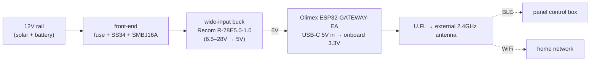
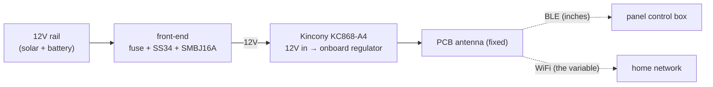

# Hardware — ESP32 bridge builds

Two documented builds for the in-vehicle BLE→WiFi bridge in [ARCHITECTURE.md](ARCHITECTURE.md). They
differ mainly in **antenna strategy**, and the right pick depends on **where you mount it**.

The bridge has two radios to keep happy: **BLE to the control box** and **WiFi to your home network**.
Where you mount the package decides which one is the hard one:

| If you're… | Pick | Because |
|---|---|---|
| mounting **away** from the control box, or want to place the antenna freely | **A. Olimex ESP32-GATEWAY-EA** | external U.FL whip you can route to the best spot — helps **both** BLE and WiFi |
| mounting the package **on/at the Auxbeam control box** | **B. Kincony KC868-A4** | 12 V-native, screw terminals, case, ESPHome-proven; **BLE is solved by proximity** — you just plan WiFi |

Mounting on the control box makes BLE a non-issue (the ESP is inches from the module), which makes the
turnkey Kincony very attractive — the cost is that its **PCB antenna is pinned to the engine bay**, so
**WiFi** becomes the variable. See [Option B's WiFi notes](#wifi-the-variable-in-this-build).

## Automotive power front-end (both builds)
A vehicle rail sits ~12.6 V at rest, ~14.4 V charging, with load-dump transients far higher. Regardless
of board, put this in front of the input:

- **Fuse at the tap** (1 A blade fuse + holder) — protects the wiring, not the board.
- **Reverse-polarity** — SS34 Schottky in series (simple, ~0.4 V drop) or a P-FET ideal-diode.
- **TVS clamp to ground** — **SMBJ16A** (16 V standoff so it's idle at 14.4 V; ~26 V clamp). Confirm your
  regulator/board input tolerates the clamp voltage; if its input spec is strict, add a wide-input
  pre-regulator (below).
- **Common ground** to vehicle chassis / panel ground.

With **solar + a large battery, constant-on is fine** — draw is tiny (see [Power budget](#power-budget)).
Want it to sleep with the vehicle? Feed the front-end from an ignition-switched circuit, or add
deep-sleep logic.

---

## Option A — Olimex ESP32-GATEWAY-EA (external antenna)
Best when the package sits away from the box, or you want to route the antenna to a good spot. The
**ESP32-WROOM-32UE** routes RF to a **U.FL connector + external 2.4 GHz whip** — the flexible-placement
choice, and it helps WiFi as much as BLE.

> Order the **`-EA`** variant (WROOM-32UE + external antenna). The plain `-E` has a PCB antenna and
> defeats the reason to pick this board.

| Part | Suggested specific | Notes |
|------|--------------------|-------|
| MCU board | **Olimex ESP32-GATEWAY-EA** (~€17) | Ethernet onboard is unused — leave it disabled |
| Enclosure | Olimex plastic box (~€8) or IP54 box | keep the antenna **outside** the box |
| Antenna | 2.4 GHz U.FL/IPEX whip (usually included with `-EA`) | mount in open air |
| Buck | **Recom R-78E5.0-1.0** (6.5–28 V→5 V) or Traco **TSR 1-2450** | 28 V ceiling swallows the charging rail; TVS only catches big spikes |
| + front-end | fuse / SS34 / SMBJ16A | see [above](#automotive-power-front-end-both-builds) |

**Power:** buck **5 V → the board's USB-C** (onboard LDO makes 3.3 V; don't also plug in USB).
**ESPHome:** `board: esp32dev` (or `esp32-gateway`); the WROOM-32UE hardwires RF to U.FL — no config.

---

## Option B — Kincony KC868-A4 (turnkey, controller-mounted)
The least-fuss build: **ESP32-WROOM-32**, **12 V-native input**, **screw terminals**, opto-isolated
inputs, an optional plastic shell, and a strong ESPHome track record ("flashed ESPHome — integration is
native and rock solid"). Mounted on the Auxbeam control box, **BLE is trivially solved by proximity**;
you'll ignore the onboard relays.

| Part | Suggested specific | Notes |
|------|--------------------|-------|
| MCU board | **Kincony KC868-A4** ($38 PCB; bundles add case + PSU) | 4 relays unused; opto inputs could be handy |
| Enclosure | Kincony plastic shell (bundle E/G) | |
| Power | **feed 12 V directly** through the front-end | no 5 V buck needed — a plus vs Option A |
| + front-end | fuse / SS34 / SMBJ16A | **verify the board's input tolerance covers 14.4 V**; if it wants a regulated 12 V, add a wide-input buck (e.g. **Recom R-78 12 V**, or a 9–36 V→12 V industrial buck) |

**ESPHome:** widely used on the KC868-A4; use Kincony's published pin map for its I/O. The BLE-client
portion of [switchpanel-bridge.esphome.yaml](switchpanel-bridge.esphome.yaml) is unchanged — keep
`framework: esp-idf` for `ble_client.ble_write`.

### WiFi — the variable in this build
With the package on the control box (often deep in engine-bay metal) and a **fixed PCB antenna**, WiFi
is the link to design around, not BLE. Options, roughly in order:

- **Improve the AP side, not the vehicle.** A garage/driveway-facing **2.4 GHz** AP or a mesh node near
  where you park is the highest-leverage fix (2.4 GHz penetrates better than 5 GHz — make sure the SSID
  is broadcast on 2.4). A directional antenna aimed at the parking spot helps further.
- **Orient the board** so its antenna end faces outward — toward a body gap, plastic panel, or the
  cabin — rather than buried against the metal box or block.
- **Lean on graceful reconnect.** ESPHome auto-reconnects and the panel state re-syncs on reconnect
  (FFF2), so intermittent WiFi degrades to "updates when in range," not broken control.
- **External-antenna variant (if offered).** If Kincony lists a **WROOM-32U / U.FL** version of the
  A4, take it and you get Option A's antenna flexibility with Option B's packaging. Otherwise the PCB
  antenna is the WiFi limiter (a module swap to WROOM-32U is possible but advanced).

---

## Power budget
ESP32 with WiFi + BLE active averages ~**100–160 mA @ 5 V** (~0.5–0.8 W) → **~60–80 mA from 12 V**. Over
a week parked that's a few Wh/day — noise against a kWh-class battery with solar. No deep-sleep needed
unless you want it.

## Safety
This bridge commands **high-current vehicle circuits** — some may drive winches or other
momentary/high-consequence loads. Keep those out of any automation (or manual-only). The wired dash
panel and RF remote remain independent overrides. No warranty; use at your own risk.

## Other board options
The LILYGO **T-CAN485** is neat and cheap with an onboard 5–12 V buck, but that input window is
**under-rated for a charging vehicle** (~14.4 V) and it has no external antenna — fine on a bench, wrong
stressors here. The two builds above cover the useful ends of the tradeoff: **A** for antenna
flexibility, **B** for turnkey packaging when you mount on the box.
